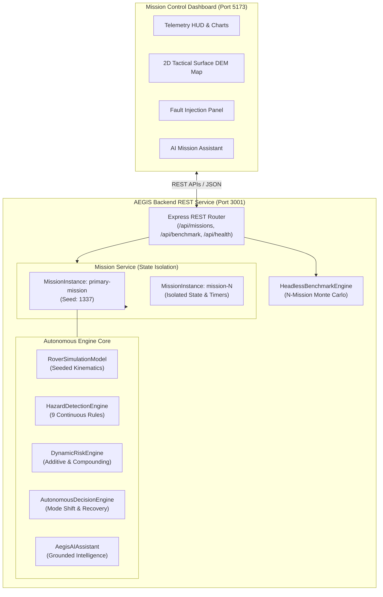

# AEGIS — Autonomous Exploration & Ground Intelligence System
**Aerospace-Grade Planetary Rover Mission-Intelligence & Autonomous Safety Architecture**  
*Developed for IndustrySolve Hackathon — IIIT Delhi*

---

## 📌 Executive Summary

### The Problem
During planetary exploration on Mars, radio frequency communications between the rover and Earth ground control experience a **one-way latency of 7 to 22 minutes** (14 to 45 minutes round-trip), punctuated by extended orbiter occultations and solar conjunction blackouts. When unexpected hazards occur—such as hidden drift sand entrapment (which claimed NASA's *Spirit* rover in 2009), steep crater scree rollovers, or subsystem thermal runaways—waiting for ground teleoperation commands can be fatal.

### The Solution: AEGIS
**AEGIS** (Autonomous Exploration & Ground Intelligence System) provides an on-board, edge-autonomous mission-intelligence and safety executive. It continuously evaluates 60+ parameters across 9 hazard vectors, calculates compounding multi-fault risk scores, triggers immediate operational mode transitions (e.g. Peristaltic Rocker-Bogie Crab-Walk extrication), recalculates risk-aware routes to solar havens, and logs explainable engineering decisions—**resolving critical anomalies in under 2 seconds at the edge rather than 45 minutes from Earth.**

---

## 🚀 Key System Features

1. **Standalone Node.js + Express REST Architecture**: Decoupled backend service running independently of browser rendering, exposing 21 validated REST endpoints.
2. **Deterministic Seeded Kinematics**: PRNG-driven 6-wheel rocker-bogie simulation guaranteeing 100% bit-accurate state replay across identical seeds.
3. **9-Vector Real-Time Hazard Engine**: Continuous automated detection across Power, Thermal, Mobility, Communications, and Terrain.
4. **Dynamic Compounding Risk Engine**: 0–100 composite risk scoring with explicit change reasoning and 5 multi-fault interaction multipliers (+25% to +40%).
5. **Explainable Autonomous Decision Executive**: Automated mode transitions between 5 operational modes with natural language engineering rationales.
6. **Peristaltic Rocker-Bogie Recovery**: Autonomous extrication protocols for deep sand entrapment and steep slope roll hazards.
7. **Headless Monte Carlo Benchmark Engine**: Quantitative validation simulating $N$ seeded missions, demonstrating a **1417x incident resolution speedup** and **100% vs 93.3% survival rate**.
8. **Context-Aware AI Mission Assistant**: Dual-tier intelligence engine grounded in live telemetry, with automatic fallback from Gemini LLM to deterministic rules.
9. **Interactive Mission Control Dashboard**: React 19 + TypeScript + Tailwind HUD featuring dynamic 2D DEM canvas mapping, real-time telemetry tiles, and scenario injection controls.

---

## 🛰️ Architecture Overview



---

## 💻 Technology Stack

| Layer | Technologies |
| :--- | :--- |
| **Backend Runtime** | Node.js (ESM), TypeScript (`~6.0.2`), tsx (`^4.23.15`) |
| **Server Framework** | Express (`^5.2.1`), cors (`^2.8.6`) |
| **Frontend Framework** | React 19 (`^19.2.8`), React DOM, Vite (`^8.3.0`), Tailwind CSS (`^4.3.3`) |
| **Testing & Quality** | Vitest (`^5.0.3`), Supertest (`^7.3.1`), JSDOM (`^30.1.1`), Oxlint (`^1.81.0`) |
| **Icons & UI** | Lucide React (`^1.50.0`), clsx, tailwind-merge |

---

## 📂 Repository Structure

```
aegis/
├── docs/                 # Official technical documentation
│   ├── ARCHITECTURE.md   # System architecture & component design
│   ├── ROADMAP.md        # Implementation roadmap across Phases 0–5
│   ├── API.md            # Complete REST API reference specification
│   ├── TESTING.md        # Test suite strategy, commands, & results
│   ├── SCENARIOS.md      # The 6 operational fault scenarios
│   ├── DECISIONS.md      # Architectural Decision Records (ADRs)
│   ├── DEMO_SCRIPT.md    # 5–7 minute hackathon presentation walkthrough
│   ├── KNOWN_LIMITATIONS.md # Known technical constraints & approximations
│   ├── CONTRIBUTING.md   # Developer guidelines & coding standards
│   └── REQUIREMENTS.md   # Requirements Traceability Matrix (RTM)
├── scripts/              # Audit & benchmark CLI scripts
│   └── testAudit.mjs     # Live HTTP pipeline, replay, & scenario audit
├── src/
│   ├── server/           # Backend Express application, models, routes, services
│   ├── simulation/       # Rover kinematics, DEM terrain, and scenarios
│   ├── engines/          # Hazard, dynamic risk, decision, and AI assistant
│   ├── components/       # React mission control dashboard components
│   ├── types/            # Canonical TypeScript schemas and enums
│   └── __tests__/        # Vitest test suites (33 tests)
├── package.json          # Dependencies and CLI scripts
├── vite.config.ts        # Vite build & frontend server configuration
└── README.md             # Project master overview
```

---

## ⚡ Quick Start & Installation

### Prerequisites
- **Node.js**: v18.0.0 or higher (v20+ recommended)
- **npm**: v9.0.0 or higher

### Installation
```bash
# 1. Clone repository
git clone https://github.com/your-org/aegis.git
cd aegis

# 2. Install dependencies
npm install
```

### Environment Variables
Environment variables can be configured via `.env` or system environment:
- `PORT`: Backend server HTTP port (default: `3001`).
- `HOST`: Backend host address (default: `0.0.0.0`).
- `GEMINI_API_KEY`: *(Optional)* Google Gemini API key for hybrid cloud LLM reasoning in the AI assistant. If omitted, the assistant operates seamlessly using its offline deterministic rules engine.

---

## 🏃 Running the Application

### 1. Launch Standalone Backend (Port 3001)
```bash
npm run server
# Or with auto-reload during development:
npm run server:dev
```
- Health Check: [http://localhost:3001/api/health](http://localhost:3001/api/health)
- Mission List: [http://localhost:3001/api/missions](http://localhost:3001/api/missions)

### 2. Launch Frontend Dashboard (Port 5173)
```bash
npm run dev
```
- Mission Control UI: [http://localhost:5173/](http://localhost:5173/)

### 3. Production Build
```bash
npm run build
```

---

## 🧪 Testing & Verification

AEGIS includes a comprehensive 33-test automated test suite:

```bash
# Run complete test suite (unit, integration, and backend tests)
npm test

# Run backend API integration tests specifically
npm run test:backend

# Run live HTTP audit (tests replay determinism, 6 scenarios, & benchmark)
node scripts/testAudit.mjs
```

### Verified Test Summary
- **Unit & Kinematic Tests** (`src/__tests__/aegis.test.ts`): 18/18 passing.
- **Backend API Tests** (`src/__tests__/backend.test.ts`): 11/11 passing.
- **Frontend Dashboard Tests** (`src/__tests__/app.integration.test.tsx`): 4/4 passing.
- **Total Passing Tests**: **33 / 33 (100% passing)**.

---

## 📡 REST API Overview

All mission endpoints support multi-mission routing using `:id` (e.g. `primary-mission`). For full request/response schemas, see [`docs/API.md`](file:///d:/Projects/Aegis/docs/API.md).

| Method | Endpoint | Description |
| :--- | :--- | :--- |
| `GET` | `/api/health` | Backend service health, uptime, and active mission count |
| `GET` | `/api/missions` | List all active isolated missions |
| `POST` | `/api/missions` | Create a new isolated mission (`{ name, seed, id }`) |
| `GET` | `/api/missions/:id` | Get mission metadata and execution state |
| `DELETE` | `/api/missions/:id` | Delete mission instance and clear background timers |
| `POST` | `/api/missions/:id/step` | Advance simulation by N ticks (`{ count, dt }`) |
| `POST` | `/api/missions/:id/start` | Start server-side continuous ticking (`{ speedMultiplier }`) |
| `POST` | `/api/missions/:id/pause` | Pause server-side ticking |
| `GET` | `/api/missions/:id/telemetry` | Get current telemetry snapshot and ring buffer history |
| `GET` | `/api/missions/:id/hazards` | Get active hazards and all 9 rule configurations |
| `PUT` | `/api/missions/:id/hazards/:type` | Update thresholds or toggle hazard rules |
| `GET` | `/api/missions/:id/risk` | Get dynamic risk score (0–100) and compounding drivers |
| `GET` | `/api/missions/:id/scenarios` | List 6 demonstration fault scenarios |
| `POST` | `/api/missions/:id/scenarios` | Inject operational scenario (`{ scenarioId }`) |
| `POST` | `/api/missions/:id/scenarios/clear` | Clear all active faults and normalize telemetry |
| `POST` | `/api/missions/:id/mitigate` | Execute autonomous mitigation protocol |
| `GET` | `/api/missions/:id/decisions` | Get decision logs and chronological event stream |
| `POST` | `/api/missions/:id/assistant` | Query context-aware AI mission assistant |
| `POST` | `/api/missions/:id/reset` | Reset mission to start coordinates (`MET 00:00:00`) |
| `POST` | `/api/missions/:id/replay` | Reset and replay mission with initial seed |
| `POST` | `/api/benchmark` | Run headless Monte Carlo benchmark across N missions |

---

## 🛡️ The 9 Hazard Vectors & 6 Scenarios

### Hazard Vectors Monitored
1. **Low Battery Reserve**: SoC $\le 25\%$ (Moderate), $\le 15\%$ (Critical).
2. **Subsystem Overheating**: Motor temps $\ge 50^\circ\text{C}$ (Moderate), $\ge 68^\circ\text{C}$ (Critical).
3. **Extreme Cryogenic Cold**: Internal chassis $\le -35^\circ\text{C}$ (Moderate), $\le -50^\circ\text{C}$ (Critical).
4. **Excessive Wheel Slip**: Traction loss ratio $\ge 0.35$ (Moderate), $\ge 0.60$ (Critical).
5. **Locomotion Entrapment (Rover Stuck)**: Zero displacement for 3 ticks with stall current $> 9.5\text{A}$.
6. **Solar Dust Deposition**: Photovoltaic conversion efficiency $\le 60\%$ (Moderate), $\le 35\%$ (Critical).
7. **Weak Communication Link / Comm Loss**: RF carrier $\le -92\text{ dBm}$ (Moderate), $\le -108\text{ dBm}$ (Critical).
8. **Dangerous Terrain Slope / Roughness**: Surface slope $\ge 18^\circ$ (Moderate), $\ge 24^\circ$ (Critical).
9. **Rapid Power Drain**: Subsystem electrical draw $\ge 380\text{W}$ (Moderate), $\ge 450\text{W}$ (Critical).

### Demonstration Scenarios
- `LOW_BATTERY`: Depleted Battery Emergency (forces `RECHARGE_STANDBY` & solar haven reroute).
- `ROVER_STUCK`: Loose Dune Sand Entrapment (88% slip; triggers `EMERGENCY_RECOVERY` & crab-walk).
- `COMM_LOSS`: Orbiter Loss-of-Signal (-116 dBm; triggers `SAFE_HOLD` Autonomous Safeguard Mode).
- `EXTREME_TEMP`: Drive Actuator Thermal Runaway (74°C motor temp; halts drive & deploys louvers).
- `SOLAR_DUST`: Martian Dust Storm Deposition (22% solar conversion; optimizes array gimbal).
- `HAZARDOUS_TERRAIN`: Belva Crater Scarp Incline (27.8° slope; executes detour spline).

---

## 📖 Comprehensive Documentation Index

All detailed technical specifications are maintained in the [`docs/`](file:///d:/Projects/Aegis/docs/) directory:
- [System Architecture Specification](file:///d:/Projects/Aegis/docs/ARCHITECTURE.md)
- [Engineering Implementation Roadmap](file:///d:/Projects/Aegis/docs/ROADMAP.md)
- [REST API Reference Manual](file:///d:/Projects/Aegis/docs/API.md)
- [Testing & Verification Strategy](file:///d:/Projects/Aegis/docs/TESTING.md)
- [Operational Fault Scenarios Catalog](file:///d:/Projects/Aegis/docs/SCENARIOS.md)
- [Architectural Decision Records (ADRs)](file:///d:/Projects/Aegis/docs/DECISIONS.md)
- [Hackathon Demonstration Script](file:///d:/Projects/Aegis/docs/DEMO_SCRIPT.md)
- [Known Limitations & Constraints](file:///d:/Projects/Aegis/docs/KNOWN_LIMITATIONS.md)
- [Engineering Contribution Guidelines](file:///d:/Projects/Aegis/docs/CONTRIBUTING.md)
- [Requirements Traceability Matrix](file:///d:/Projects/Aegis/docs/REQUIREMENTS.md)

---

## ⚠️ Mission Simulation Disclaimer

> **IMPORTANT**: AEGIS is a software-only planetary rover mission-intelligence and safety autonomy prototype developed for academic evaluation and hackathon competition. It is **not flight-qualified software** under NASA NPR 7150.2 or DO-178C standards, and is not intended to control physical flight hardware or live spacecraft missions without extensive hardware-in-the-loop (HIL) qualification, real-time operating system (RTOS) re-hosting, and radiation hardening.
