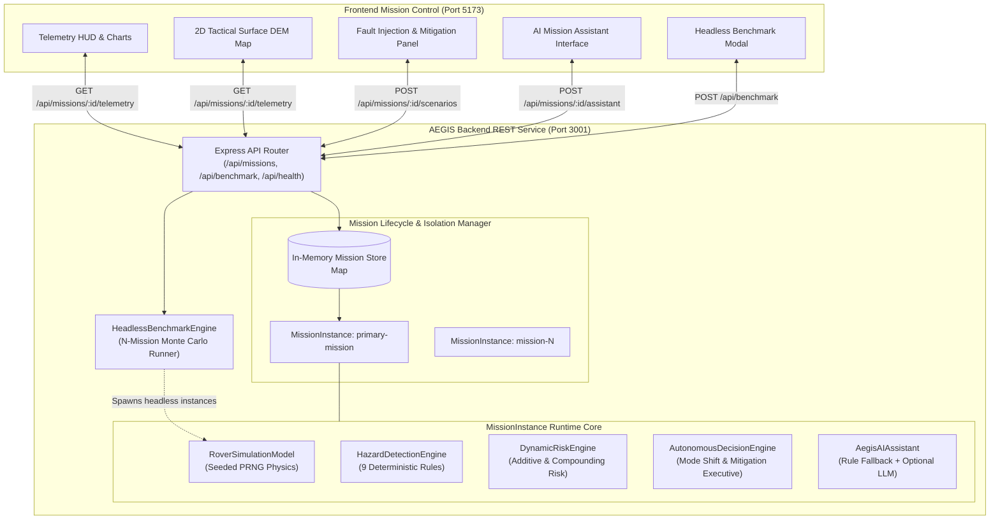
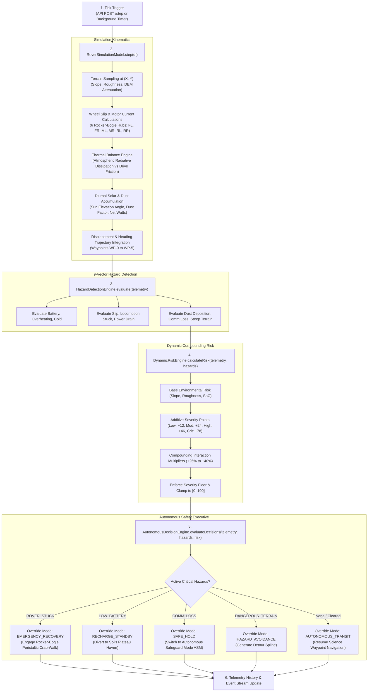
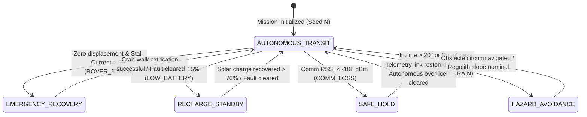
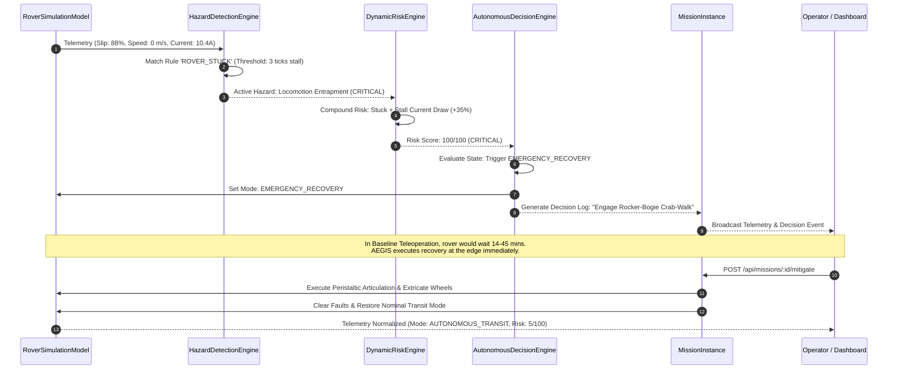

# AEGIS — System Architecture Specification

The **Autonomous Exploration & Ground Intelligence System (AEGIS)** is designed as an edge-autonomous, server-orchestrated rover safety and mission-intelligence architecture for simulated planetary surface operations (Mars Jezero Crater Sector 4).

---

## 1. High-Level Architecture Overview

AEGIS employs a decoupled full-stack architecture:
1. **Core Autonomy & Simulation Backend** ([`src/server/`](file:///d:/Projects/Aegis/src/server/)): A standalone Node.js + Express + TypeScript service that manages mission lifecycles, runs deterministic kinematic physics, evaluates continuous hazard vectors, calculates compounding risk, and executes autonomous mitigations.
2. **Mission Control Frontend Dashboard** ([`src/components/`](file:///d:/Projects/Aegis/src/components/)): A high-performance React 19 + TypeScript + Tailwind mission dashboard that polls and renders telemetry HUDs, dynamic tactical 2D DEM canvas maps, 9-rule matrix configurations, live hazard streams, and benchmark visualizations.

---

## 2. Backend Component Responsibilities

| Component | Source File | Core Responsibility |
| :--- | :--- | :--- |
| **Server Entrypoint** | [`src/server/server.ts`](file:///d:/Projects/Aegis/src/server/server.ts) | Binds HTTP listener (Port 3001), handles process signals (SIGINT/SIGTERM), triggers graceful cleanup. |
| **Express Application** | [`src/server/app.ts`](file:///d:/Projects/Aegis/src/server/app.ts) | Configures CORS, JSON parsers, route middleware, request logging, 404 handler, and global error handling. |
| **Mission Service** | [`src/server/services/missionService.ts`](file:///d:/Projects/Aegis/src/server/services/missionService.ts) | Manages multi-mission map, generates IDs, ensures unique mission isolation, creates default Jezero mission. |
| **Mission Instance** | [`src/server/models/missionInstance.ts`](file:///d:/Projects/Aegis/src/server/models/missionInstance.ts) | Owns dedicated simulation, hazard, risk, and decision engine instances. Coordinates background interval timers. |
| **Benchmark Service** | [`src/server/services/benchmarkService.ts`](file:///d:/Projects/Aegis/src/server/services/benchmarkService.ts) | Headless Monte Carlo engine simulating N missions to measure survival rates and edge autonomy speedup. |
| **Simulation Model** | [`src/simulation/roverModel.ts`](file:///d:/Projects/Aegis/src/simulation/roverModel.ts) | Seeded PRNG kinematic physics, 6-wheel rocker-bogie slip, solar diurnal cycles, and thermal exchange. |
| **Hazard Engine** | [`src/engines/hazardEngine.ts`](file:///d:/Projects/Aegis/src/engines/hazardEngine.ts) | Real-time threshold evaluation across 9 continuous telemetry vectors. |
| **Risk Engine** | [`src/engines/riskEngine.ts`](file:///d:/Projects/Aegis/src/engines/riskEngine.ts) | 0–100 risk scoring with additive points, floor guarantees, and 5 compounding interaction multipliers. |
| **Decision Engine** | [`src/engines/decisionEngine.ts`](file:///d:/Projects/Aegis/src/engines/decisionEngine.ts) | Mode transition logic, peristaltic extraction command triggers, and chronological audit event logging. |
| **AI Assistant** | [`src/engines/aiAssistantEngine.ts`](file:///d:/Projects/Aegis/src/engines/aiAssistantEngine.ts) | Natural language query engine grounded in live telemetry, with offline deterministic rules and Gemini fallback. |

---

## 3. Telemetry-to-Decision Pipeline

Every simulation step (`dtSeconds >= 0`) executes a strict sequential pipeline:

---

## 4. Operational Modes & State Transitions

The rover operates under a 5-mode safety executive state machine:

| Mode | Trigger Conditions | Automated Actions |
| :--- | :--- | :--- |
| **`AUTONOMOUS_TRANSIT`** | All 9 hazard vectors nominal; regolith slope `< 18°`. | Standard waypoint navigation (speed: 0.12–0.18 m/s, forward heading locked). |
| **`EMERGENCY_RECOVERY`** | `ROVER_STUCK` (0 m/s for 3 ticks with stall amps > 9.5A). | Locks steering, activates rocker-bogie peristaltic crab-walk, reverses wheel torque. |
| **`SAFE_HOLD`** | `COMM_LOSS` (`< -108 dBm`). | Halts locomotion, buffers telemetry to flash RAM, enters low-power safeguard. |
| **`HAZARD_AVOIDANCE`** | `DANGEROUS_TERRAIN` (slope `> 24°`), `WHEEL_SLIP > 0.60`. | Throttles speed by 50%, brakes, samples local DEM mesh, generates detour spline. |
| **`RECHARGE_STANDBY`** | `LOW_BATTERY` (`< 15%`), photovoltaic dust deposition (`> 75%`). | Suspends science payloads, halts night transit, diverts to Solis Plateau Solar Haven. |

---

## 5. Hazard Response & Autonomous Recovery Workflow

When a critical fault occurs, the system responds within 1–2 execution ticks without waiting for Earth intervention:

---

## 6. Mission Isolation & Lifecycle Management

Missions are isolated within [`MissionService`](file:///d:/Projects/Aegis/src/server/services/missionService.ts) via an in-memory dictionary:
- **Unique Instances**: Each mission instantiates its own `RoverSimulationModel` (with independent PRNG seed), `HazardDetectionEngine` (with configurable rule thresholds), `DynamicRiskEngine`, `AutonomousDecisionEngine`, and `AegisAIAssistant`.
- **Timer Quarantine**: Background simulation loops run on independent `setInterval` timers. The `start()`, `pause()`, `reset()`, and `cleanup()` methods invoke `stopTimer()`, preventing timer collisions or cross-mission leakage.
- **Garbage Collection**: Calling `DELETE /api/missions/:id` stops all active interval timers and removes the instance from the lookup map.

---

## 7. Headless Benchmark Architecture

The [`HeadlessBenchmarkEngine`](file:///d:/Projects/Aegis/src/server/services/benchmarkService.ts) runs Monte Carlo batch simulations without HTTP overhead or DOM rendering:
- Simulates $N$ independent rover missions across varying pseudo-random seeds ($1000 + m \times 37$).
- Simulates realistic mid-traverse fault injections (stuck, low battery, overheating).
- Measures empirical survival rates, power consumption, traverse velocity, and resolution times between:
  1. **AEGIS Edge Autonomy**: Resolves incidents autonomously within 1.8 seconds (1–2 ticks).
  2. **Baseline Ground Teleoperation**: Stalls during the 14–45 minute Earth round-trip light-delay window (modeled as 2550 seconds per incident with a 35% stall failure risk).
- Metrics are calculated dynamically from actual accumulated simulation ticks—never hardcoded.
