# AEGIS — Engineering Implementation Roadmap

This document outlines the engineering implementation roadmap for the **Autonomous Exploration & Ground Intelligence System (AEGIS)**. All tasks are mapped to actual repository modules, verified against test suites, and classified by hackathon priority.

---

## 📌 Status & Priority Taxonomy

| Status | Definition |
| :--- | :--- |
| **Completed** | Implemented in codebase, covered by unit/integration tests, verified in live runtime. |
| **In Progress** | Active code exists but requires test expansion, tuning, or secondary edge-case handling. |
| **Not Started** | Defined in specifications/architecture but no concrete backend implementation exists yet. |
| **Blocked** | Dependent on external hardware, third-party credentials, or upstream architectures. |

| Priority | Level |
| :--- | :--- |
| **P0** | **Critical Mission Blocker**: Core simulation, hazard detection, safety executive, and essential REST APIs. |
| **P1** | **High Impact**: Recovery mechanisms, benchmark correctness, determinism, mission isolation. |
| **P2** | **Medium Enhancement**: AI assistant intelligence, persistent storage, extended terrain topologies. |
| **P3** | **Nice to Have**: Multi-rover swarm coordination, hardware-in-the-loop (HIL) telemetry serial bridge. |

---

## 📅 Roadmap Overview

```mermaid
gantt
    title AEGIS Backend Development & Verification Phases
    dateFormat  X
    axisFormat %s

    section Phase 0: Stability
    Codebase Audit & Core Restructuring   :done, p0_1, 0, 10
    Timer & Memory Leak Hardening         :done, p0_2, 5, 15

    section Phase 1: Core Reliability
    Isolated Mission Instances & Service :done, p1_1, 10, 25
    9-Vector Hazard Detection Engine      :done, p1_2, 15, 30
    Dynamic Compounding Risk Engine      :done, p1_3, 20, 35
    Deterministic PRNG Simulation        :done, p1_4, 15, 30

    section Phase 2: Autonomy & Recovery
    Executive Mode Transitions            :done, p2_1, 30, 45
    Autonomous Mitigation & Extrication   :done, p2_2, 35, 50
    Detour Path Planning & Solar Havens   :done, p2_3, 35, 50

    section Phase 3: Benchmarking
    Headless Monte Carlo Benchmark Engine :done, p3_1, 45, 60
    Telemetry Replay Verification        :done, p3_2, 50, 65

    section Phase 4: Delivery
    Comprehensive REST API Surface       :done, p4_1, 55, 75
    AI Mission Assistant Engine           :done, p4_2, 60, 80
    Persistent Database Storage          :active, p4_3, 75, 100
```

---

## Phase 0 — Current State & Stability

### Tasks

#### 0.1 Backend/Frontend Decoupling
- **Status**: `Completed`
- **Priority**: `P0`
- **Expected Outcome**: Simulation, hazard detection, risk assessment, and decision modules run in pure Node.js without DOM or React runtime dependencies.
- **Dependencies**: None
- **Acceptance Criteria**: Express backend starts cleanly (`npm run server`) and responds on port 3001 without frontend running.
- **Relevant Files**: [`src/server/server.ts`](file:///d:/Projects/Aegis/src/server/server.ts), [`src/server/app.ts`](file:///d:/Projects/Aegis/src/server/app.ts)

#### 0.2 Simulation Timer & Memory Leak Mitigation
- **Status**: `Completed`
- **Priority**: `P0`
- **Expected Outcome**: Background simulation intervals stop upon pause, reset, or mission deletion. In-memory arrays are strictly bounded.
- **Dependencies**: Task 0.1
- **Acceptance Criteria**: No orphaned `setInterval` handles; `telemetryHistory` capped at 100, `logs` capped at 300, `trail` capped at 300.
- **Relevant Files**: [`src/server/models/missionInstance.ts`](file:///d:/Projects/Aegis/src/server/models/missionInstance.ts), [`src/simulation/roverModel.ts`](file:///d:/Projects/Aegis/src/simulation/roverModel.ts)

#### 0.3 Telemetry Recovery Normalization on Fault Clear
- **Status**: `Completed`
- **Priority**: `P1`
- **Expected Outcome**: Injected faults cleared by operators restore degraded physical properties (e.g. low battery 18% -> 85%, motor temp 70°C -> 28°C) to nominal baselines.
- **Dependencies**: Task 0.1
- **Acceptance Criteria**: Sequential scenario tests do not inherit residual failure states.
- **Relevant Files**: [`src/simulation/roverModel.ts`](file:///d:/Projects/Aegis/src/simulation/roverModel.ts#L129-L135)

---

## Phase 1 — Core Backend Reliability

### Tasks

#### 1.1 Multi-Mission Instance Management & State Isolation
- **Status**: `Completed`
- **Priority**: `P0`
- **Expected Outcome**: Concurrent missions run independently with dedicated seeds, telemetry streams, and hazard configs.
- **Dependencies**: Phase 0
- **Acceptance Criteria**: State updates or faults in `mission-alpha` cause zero side-effects in `mission-beta`.
- **Relevant Files**: [`src/server/services/missionService.ts`](file:///d:/Projects/Aegis/src/server/services/missionService.ts), [`src/server/models/missionInstance.ts`](file:///d:/Projects/Aegis/src/server/models/missionInstance.ts)

#### 1.2 9-Vector Hazard Detection Engine
- **Status**: `Completed`
- **Priority**: `P0`
- **Expected Outcome**: Automated real-time telemetry evaluation across 9 hazard vectors (Battery, Overheating, Cold, Wheel Slip, Stuck, Dust, Comm Loss, Dangerous Terrain, Power Drain).
- **Dependencies**: Task 1.1
- **Acceptance Criteria**: Verified against unit tests for all 9 vector thresholds and severity classes (`LOW`, `MODERATE`, `HIGH`, `CRITICAL`).
- **Relevant Files**: [`src/engines/hazardEngine.ts`](file:///d:/Projects/Aegis/src/engines/hazardEngine.ts), [`src/__tests__/aegis.test.ts`](file:///d:/Projects/Aegis/src/__tests__/aegis.test.ts)

#### 1.3 Dynamic Compounding Risk Engine
- **Status**: `Completed`
- **Priority**: `P0`
- **Expected Outcome**: 0–100 risk score calculation with additive points, floor constraints, primary concern identification, and 5 compounding interaction multipliers.
- **Dependencies**: Task 1.2
- **Acceptance Criteria**: Multi-fault conditions (e.g. Low Battery + Comm Loss) trigger compounding risk multipliers (+35%).
- **Relevant Files**: [`src/engines/riskEngine.ts`](file:///d:/Projects/Aegis/src/engines/riskEngine.ts), [`src/__tests__/aegis.test.ts`](file:///d:/Projects/Aegis/src/__tests__/aegis.test.ts)

#### 1.4 Deterministic PRNG Seeded Simulation Engine
- **Status**: `Completed`
- **Priority**: `P0`
- **Expected Outcome**: Linear congruential generator providing bit-accurate deterministic rover physics across identical seeds.
- **Dependencies**: Phase 0
- **Acceptance Criteria**: Repeated runs with seed `9999` produce 100% identical telemetry, hazard, and risk outputs.
- **Relevant Files**: [`src/simulation/roverModel.ts`](file:///d:/Projects/Aegis/src/simulation/roverModel.ts#L10-L40), [`scripts/testAudit.mjs`](file:///d:/Projects/Aegis/scripts/testAudit.mjs)

---

## Phase 2 — Autonomy & Recovery

### Tasks

#### 2.1 Autonomous Decision Executive & Mode Shifts
- **Status**: `Completed`
- **Priority**: `P0`
- **Expected Outcome**: Automatic transitions between operational modes (`AUTONOMOUS_TRANSIT`, `SAFE_HOLD`, `EMERGENCY_RECOVERY`, `HAZARD_AVOIDANCE`, `RECHARGE_STANDBY`).
- **Dependencies**: Phase 1
- **Acceptance Criteria**: `ROVER_STUCK` automatically switches mode to `EMERGENCY_RECOVERY`; `COMM_LOSS` forces `SAFE_HOLD`.
- **Relevant Files**: [`src/engines/decisionEngine.ts`](file:///d:/Projects/Aegis/src/engines/decisionEngine.ts)

#### 2.2 Autonomous Mitigation Protocols
- **Status**: `Completed`
- **Priority**: `P1`
- **Expected Outcome**: Execution of safety mitigations: Rocker-Bogie Peristaltic Crab-Walk, thermal louver deployment, and solar array tilt optimization.
- **Dependencies**: Task 2.1
- **Acceptance Criteria**: POST `/api/missions/:id/mitigate` clears trapped condition and updates operational logs.
- **Relevant Files**: [`src/server/models/missionInstance.ts`](file:///d:/Projects/Aegis/src/server/models/missionInstance.ts#L282-L330)

#### 2.3 Energy- & Risk-Aware Path Planning (Detour Routing & Solar Havens)
- **Status**: `Completed`
- **Priority**: `P1`
- **Expected Outcome**: Route recalculation around hazardous craters/dunes, nearest recharge plateau lookup (`findNearestRechargeZone`).
- **Dependencies**: Phase 1
- **Acceptance Criteria**: Low-battery states trigger reroute toward Solis Plateau Solar Haven; dangerous terrain triggers contour-following detour.
- **Relevant Files**: [`src/simulation/terrainMap.ts`](file:///d:/Projects/Aegis/src/simulation/terrainMap.ts), [`src/engines/decisionEngine.ts`](file:///d:/Projects/Aegis/src/engines/decisionEngine.ts)

---

## Phase 3 — Benchmarking & Validation

### Tasks

#### 3.1 Headless Monte Carlo Benchmark Engine
- **Status**: `Completed`
- **Priority**: `P1`
- **Expected Outcome**: Quantitative headless evaluation comparing AEGIS edge autonomy vs traditional 14-minute Earth ground teleoperation across N seeded missions.
- **Dependencies**: Phase 1 & 2
- **Acceptance Criteria**: Metrics (survival rate, incident resolution, speedup factor, power saved) are calculated dynamically from real simulated ticks.
- **Relevant Files**: [`src/server/services/benchmarkService.ts`](file:///d:/Projects/Aegis/src/server/services/benchmarkService.ts), [`src/server/routes/benchmarkRoutes.ts`](file:///d:/Projects/Aegis/src/server/routes/benchmarkRoutes.ts)

#### 3.2 Scenario Test Catalog (6 Fault Scenarios)
- **Status**: `Completed`
- **Priority**: `P1`
- **Expected Outcome**: Verified injection and autonomous handling of all 6 scenarios: `LOW_BATTERY`, `ROVER_STUCK`, `COMM_LOSS`, `EXTREME_TEMP`, `SOLAR_DUST`, `HAZARDOUS_TERRAIN`.
- **Dependencies**: Phase 1 & 2
- **Acceptance Criteria**: POST `/api/missions/:id/scenarios` triggers expected hazard, alters risk level, and generates explainable event logs.
- **Relevant Files**: [`src/simulation/scenarioDefinitions.ts`](file:///d:/Projects/Aegis/src/simulation/scenarioDefinitions.ts), [`scripts/testAudit.mjs`](file:///d:/Projects/Aegis/scripts/testAudit.mjs)

---

## Phase 4 — Integration & Demonstration

### Tasks

#### 4.1 Comprehensive REST API Interface
- **Status**: `Completed`
- **Priority**: `P0`
- **Expected Outcome**: Full REST API covering health, missions, simulation stepping, ticking controls, telemetry, hazards, risk, decisions, mitigations, and assistant.
- **Dependencies**: Phase 1, 2, 3
- **Acceptance Criteria**: 21 verified endpoints returning standardized JSON with strict status codes (200, 201, 400, 404, 500).
- **Relevant Files**: [`src/server/routes/missionRoutes.ts`](file:///d:/Projects/Aegis/src/server/routes/missionRoutes.ts)

#### 4.2 Context-Aware AI Mission Assistant
- **Status**: `Completed`
- **Priority**: `P1`
- **Expected Outcome**: Natural language query engine grounded in live mission telemetry and active hazards, with heuristic fallback when Gemini API key is absent.
- **Dependencies**: Task 4.1
- **Acceptance Criteria**: POST `/api/missions/:id/assistant` returns context-grounded responses for safety, battery, and hazard queries.
- **Relevant Files**: [`src/engines/aiAssistantEngine.ts`](file:///d:/Projects/Aegis/src/engines/aiAssistantEngine.ts)

#### 4.3 Persistent Database Storage (SQLite / PostgreSQL)
- **Status**: `Not Started`
- **Priority**: `P2`
- **Expected Outcome**: Mission state, event logs, and telemetry histories persisted across backend process restarts.
- **Dependencies**: Task 4.1
- **Acceptance Criteria**: Restarting the server retains existing missions and their accumulated event history.
- **Relevant Files**: Future implementation in `src/server/db/`

---

## Phase 5 — Final Hackathon Delivery

### Tasks

#### 5.1 End-to-End Test Suite & Build Verification
- **Status**: `Completed`
- **Priority**: `P0`
- **Expected Outcome**: 100% passing tests and error-free TypeScript/Vite production build.
- **Dependencies**: All prior phases
- **Acceptance Criteria**: `npm test` passes 33/33 tests; `npm run build` succeeds in < 2 seconds.
- **Relevant Files**: [`src/__tests__/aegis.test.ts`](file:///d:/Projects/Aegis/src/__tests__/aegis.test.ts), [`src/__tests__/backend.test.ts`](file:///d:/Projects/Aegis/src/__tests__/backend.test.ts), [`src/__tests__/app.integration.test.tsx`](file:///d:/Projects/Aegis/src/__tests__/app.integration.test.tsx)

#### 5.2 Technical Documentation & Demo Script
- **Status**: `Completed`
- **Priority**: `P0`
- **Expected Outcome**: Complete architectural specifications, API schemas, scenario guides, ADRs, limitations, and live demo walkthrough.
- **Dependencies**: Task 5.1
- **Acceptance Criteria**: All documents present in `docs/`, cross-referenced, and verified against codebase behavior.
- **Relevant Files**: `docs/*.md`
